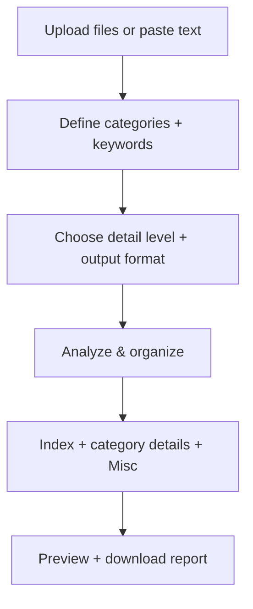

# 🗂️ Document Organizer

Upload or paste JSON/PDF/TXT content, define your categories, and generate a neatly
organized report with a full index and details per category.

[](https://blank-app-template.streamlit.app/)

## How it works (buttons & configuration)



### What each control does
- **Upload files / Paste content**: Add JSON, PDF, or TXT content to analyze.
- **Define sections**: One category per line; optional keywords after a colon.
- **Detail level**: Full text (most accurate) or snippets (shorter output).
- **Output format**: Download as Markdown or plain text.
- **Retry JSON parsing**: Best-effort repair for lightly malformed JSON.
- **Analyze & organize**: Runs the categorization, index creation, and verification pass.
- **Preview**: See the generated report before downloading.

## Get the project (download first)

You must have the project folder on your computer before running anything.

### Option A: GitHub (recommended)
Run these **in your terminal/command line**:

```
git clone <PASTE_GITHUB_REPO_URL>
cd <REPO_FOLDER_NAME>
```

### Option B: ZIP download
1. Download the ZIP from GitHub (or wherever you received it).
2. Unzip it.
3. Open terminal and go to the unzipped folder:

```
cd /path/to/unzipped-folder
```

## Run the app

Run these commands **in your terminal/command line**:

1. Install the requirements

   ```
   $ pip install -r requirements.txt
   ```

2. Run the app

   ```
   $ streamlit run streamlit_app.py
   ```
