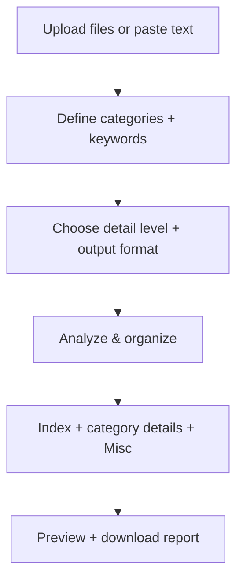

# 🗂️ Document Organizer

Upload or paste JSON/PDF/TXT content, define your categories, and generate a neatly
organized report with a full index and details per category.

[](https://blank-app-template.streamlit.app/)

## How it works (buttons & configuration)


```mermaid
flowchart TD
    A[Upload files or paste text] --> B[Define categories + keywords]
    B --> C[Choose detail level + output format]
    C --> D[Analyze & organize]
    D --> E[Index + category details + Misc]
    E --> F[Preview + download report]
```

### What each control does
- **Upload files / Paste content**: Add JSON, PDF, or TXT content to analyze.
- **Define sections**: One category per line; optional keywords after a colon.
- **Detail level**: Full text (most accurate) or snippets (shorter output).
- **Output format**: Download as Markdown or plain text.
- **Retry JSON parsing**: Best-effort repair for lightly malformed JSON.
- **Analyze & organize**: Runs the categorization, index creation, and verification pass.
- **Preview**: See the generated report before downloading.

## Get the project (download first)

You must have the project folder on your computer before running anything.

### Option A: GitHub (recommended)
Run these **in your terminal/command line**:

```
git clone <PASTE_GITHUB_REPO_URL>
cd <REPO_FOLDER_NAME>
```

### Option B: ZIP download
1. Download the ZIP from GitHub (or wherever you received it).
2. Unzip it.
3. Open terminal and go to the unzipped folder:

```
cd /path/to/unzipped-folder
```

## Run the app

Run these commands **in your terminal/command line**:
# 🗂️ File Organizer & Index Builder

This Streamlit app lets you upload or paste text, define custom categories, build an index, and
download an organized report.

## Quickstart (local)

1. Install the requirements

   ```
   pip install -r requirements.txt
   ```

2. Run the app

   ```
   streamlit run streamlit_app.py
   ```

3. Open the app in your browser

   ```
   http://localhost:8501
   ```

### One-line quick start (copy/paste once)

If you want a single command, use this (from your repo folder):

```
cd ~/Downloads/blank-app && python3 -m pip install -r requirements.txt && python3 -m streamlit run streamlit_app.py --server.port 8502
```

Then open: `http://localhost:8502`
## Using the app

1. Upload a file (JSON, TXT, CSV, MD, or PDF) **or** paste text into the text area.
2. Enter the categories you want to organize by (comma or newline separated).
3. Pick the detail level and whether to include all non-matching content in the Misc section.
4. Click **Organize & Build Index** to generate and download the report.

## Large files (700MB)

Streamlit uploads are limited by server memory and configuration. If large uploads fail, increase
the upload limit in a `.streamlit/config.toml` file:

```toml
[server]
maxUploadSize = 700
```

You can also paste text in chunks if needed.
