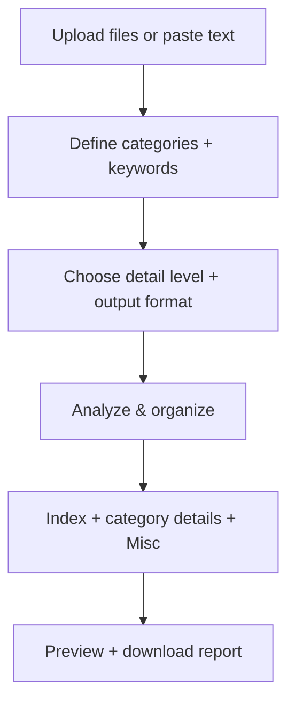

# 🗂️ File Organizer & Index Builder

Upload or paste JSON/PDF/TXT content, define categories, and generate a clean report with:
- a full file index,
- category-by-category grouped output,
- optional snippets/full text,
- downloadable Markdown or TXT.
This Streamlit app lets you upload or paste text, define custom categories, build an index, and
download an organized report.

## Quickstart (local)

## Project files (everything you need)
- `streamlit_app.py` → the app code.
- `requirements.txt` → Python dependencies (`streamlit`, `PyPDF2`).
- `README.md` → setup + usage instructions.
- `LICENSE` → license terms.

## Quick product flow


```mermaid
flowchart TD
    A[Upload files or paste text] --> B[Define categories + keywords]
    B --> C[Choose detail level + output format]
    C --> D[Analyze & organize]
    D --> E[Index + category details + Misc]
    E --> F[Preview + download report]
```

## What each UI control does
- **Upload files / Paste content**: Add JSON, PDF, or TXT content to analyze.
- **Define sections**: One category per line; optional keywords after a colon.
- **Detail level**: Full text (most complete) or snippets (shorter output).
- **Output format**: Download as Markdown (`.md`) or plain text (`.txt`).
- **Retry JSON parsing**: Attempts light cleanup for malformed JSON.
- **Analyze & organize**: Runs extraction, keyword matching, grouping, and output generation.
- **Preview**: Shows generated report before download.

---

## Exactly what to install
You only need:
1. **Python 3.10+**
2. **Git** (only if cloning; not needed if using ZIP)

You do **not** install Streamlit/PyPDF2 manually one-by-one; `pip install -r requirements.txt` installs both.

---

## Run locally (outside Codex/ChatGPT) — exact commands

## Option A: macOS / Linux (copy-paste exactly)

### Step 1) Check Python and pip
```bash
python3 --version
pip3 --version
```

### Step 2) Get the code
Replace with your actual repo URL:
```bash
git clone https://github.com/<your-user>/<your-repo>.git
cd <your-repo>
```

If you downloaded ZIP instead, unzip and then:
```bash
cd /path/to/unzipped-folder
```

### Step 3) Create + activate virtual environment
```bash
python3 -m venv .venv
source .venv/bin/activate
```

### Step 4) Install dependencies
```bash
pip install -r requirements.txt
```

### Step 5) Run app
```bash
streamlit run streamlit_app.py
```

### Step 6) Open in browser
Open:
```text
http://localhost:8501
```

### Step 7) Stop app
In terminal:
```text
Ctrl + C
```

---

## Option B: Windows PowerShell (copy-paste exactly)

### Step 1) Check Python and pip
```powershell
python --version
pip --version
```

### Step 2) Get the code
Replace with your actual repo URL:
```powershell
git clone https://github.com/<your-user>/<your-repo>.git
cd <your-repo>
```

If you downloaded ZIP instead, unzip and then:
```powershell
cd C:\path\to\unzipped-folder
```

### Step 3) Create + activate virtual environment
```powershell
python -m venv .venv
.\.venv\Scripts\Activate.ps1
```

### Step 4) Install dependencies
```powershell
pip install -r requirements.txt
```

### Step 5) Run app
```powershell
streamlit run streamlit_app.py
```

### Step 6) Open in browser
Open:
```text
http://localhost:8501
```

### Step 7) Stop app
In terminal:
```text
Ctrl + C
```

---

## Common issues (fast fixes)

### `streamlit: command not found`
Use:
```bash
python -m streamlit run streamlit_app.py
```

### `pip` installs globally by mistake
Make sure virtualenv is active first:
- macOS/Linux prompt should usually show `(.venv)`
- Windows PowerShell prompt should usually show `(.venv)`

### Large upload fails
Streamlit default upload limit is ~200MB. Increase via config:

```toml
# ~/.streamlit/config.toml (macOS/Linux)
# %USERPROFILE%\.streamlit\config.toml (Windows)
[server]
maxUploadSize = 700
```

### PDF parsing errors
This app uses `PyPDF2`; image-only/scanned PDFs may not contain extractable text.

---

## Commands used to verify this repo
```bash
python3 -m compileall streamlit_app.py
python3 - <<'PY'
import io
from PyPDF2 import PdfWriter
import streamlit_app as app

writer = PdfWriter()
writer.add_blank_page(width=72, height=72)
buf = io.BytesIO()
writer.write(buf)
text, err = app.extract_text_from_pdf(buf.getvalue())
assert err is None, err
assert isinstance(text, str)

rules = app.parse_section_rules('Finance: budget,invoice\nEngineering: api,backend')
assert len(rules) == 2
matched = app.match_keywords('The backend api budget was approved', rules[1])
assert 'api' in [m.lower() for m in matched]
print('smoke tests passed')
PY
```
1. Install the requirements

   ```
   pip install -r requirements.txt
   ```

2. Run the app

   ```
   streamlit run streamlit_app.py
   ```

3. Open the app in your browser

   ```
   http://localhost:8501
   ```

## Using the app

1. Upload a file (JSON, TXT, CSV, MD, or PDF) **or** paste text into the text area.
2. Enter the categories you want to organize by (comma or newline separated).
3. Pick the detail level and whether to include all non-matching content in the Misc section.
4. Click **Organize & Build Index** to generate and download the report.

## Large files (700MB)

Streamlit uploads are limited by server memory and configuration. If large uploads fail, increase
the upload limit in a `.streamlit/config.toml` file:

```toml
[server]
maxUploadSize = 700
```

You can also paste text in chunks if needed.
